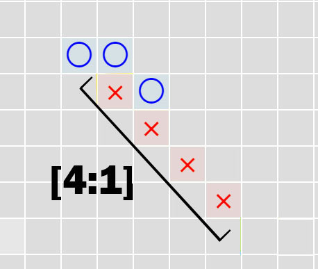

# Tinkoff Hackaton
# Проект сделан для участия в Хакатоне Тинькофф 11.2023
**Написан на python с использованием библиотеки Flask как основной**

**Реализован следующий функционал:**

    - Написан алгоритм для поиска лучшего хода в игре Гомоку (19х19)
    - Реализована связь с сервисом медиатором
    - Код завернут в докерконтейнер
    - Соответствует стандарту RESTfull приложения

**Принцип работы алгоритма поиска лучшего хода:**

Для того, чтобы найти лучший ход высчитывается вес каждой незнаковой клетки, тоесть клетки в которой не стоит крестик или нолик, путем определения всех атак из данной клетки. Для лучшего понимания обозначим "атакой" - несколько одинаковых фигур стоящих рядом друг с другом, колличество подряд стоящих фигур назовем мощностью (capatibility), а колличество пустых клеток на "концах" атаки назовем ее потенциалом (potential)
    


Представим, что на игровом поле уже есть несколько атак одного и второго игрока. Кто-то из игроков делает ход (пускай крестики). Естественно ход он делает в пустую клетку – и тем самым он может:

    1. Развить свою атаку, а может быть и не одну, увеличив ее мощность. Может начать новую атаку и т.д.
    2. Препятствовать развитию атаки противника или и вовсе заблокировать ее.

То есть, наш протагонист может атаковать и защищаться. А может и все сразу одним ходом. Для него важно, как первое, так и второе.

Суть анализа в следующем:

    1. Бот подставляет в проверяемую клетку фигуры: сначала крестик, потом нолик.
    2. Далее он ищет все атаки, которые были получены такими ходами и суммирует их веса.
    3. Полученная сумма – это вес клетки.
    4. Подобный алгоритм выполняется для всех клеток игрового поля.
    
## Запуск бота с использованием Docker

### Требования

- Docker

### Инструкции по запуску

- Сначала склонируйте репозиторий:

   ```bash
   git clone https://github.com/Vantany/Tinkoff-Hackaton.git
   cd Tinkoff-Hackaton

- Соберите Docker-образ:

    ```bash
    docker build -t 

- Запустите контейнер:

    ```bash
    docker run -d bot.py
    docker run -d Main.py
Теперь бот должен быть доступен для использования.

## Использование бота
Бот предоставляет HTTP API для игры в гомоку. Пример использования с помощью curl:

    bash
    curl -X POST -H "Content-Type: application/json" -d '{"move": 3}' http://localhost:5000/play
    # Где move - это номер столбца, в который вы хотите сделать ход.

### Дополнительные настройки
Вы можете настроить различные параметры бота. Ознакомьтесь с файлом config.py для их изменения.
